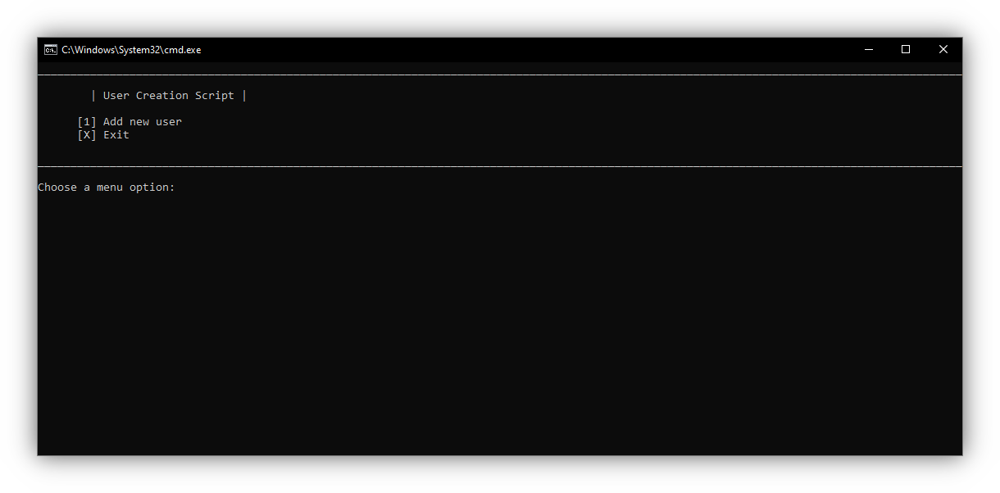

# User-Creation-Script

Script for creating a new user and logging in to it using RDP

## Why it's needed

Simply using "net user \<name\> /add" or adding a user via settings will NOT fully create the user. Logging into the created user is necessary to complete the process.

## How it works:

Once the user enters their desired username and password for the new account, the script creates the user using "net user \<name\> /add". The Remote Desktop Protocol (RDP) is used for logging in.

Since Windows 10 has many artificial limitations on using RDP, RDPWrap is used in its place. This allows for RDP to work on any Windows 10 version, with no hindering limitations.

Once RDPWrap is installed, a simple registry change is made to disable the privacy menu when a new user logs in. This is needed otherwise the process can't be automated.

After the registry change is made, wFreeRDP is used to login. This program allows for automatically entering the username and password to the new account. Using 127.0.0.2 as a connection IP, it can connect to the same computer it's running on.

Ideally the wFreeRDP taskbar icon should be hidden, but it seemed to be impossible to start it as Hidden (Using Start-Process -WindowStyle Hidden did not work). So, instead, once the script detects the wFreeRDP window is open, it hides it.

